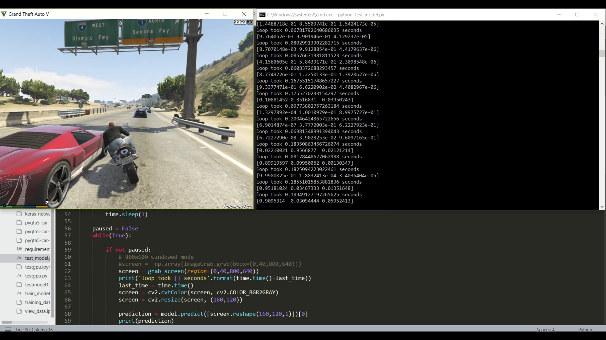
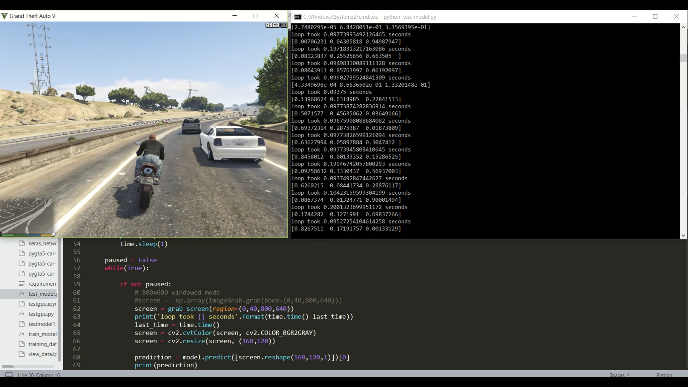

# AI-Plays-GTA5
A bike-riding agent in a virtual environment (GTA5), built using CNN, used for simulating self-driving vehicles.

References: https://github.com/sentdex/pygta5

## Libraries used
Keras 
Numpy 
Pandas
Tensorflow-gpu
opencv-python
Ctypes 

## Screenshots

